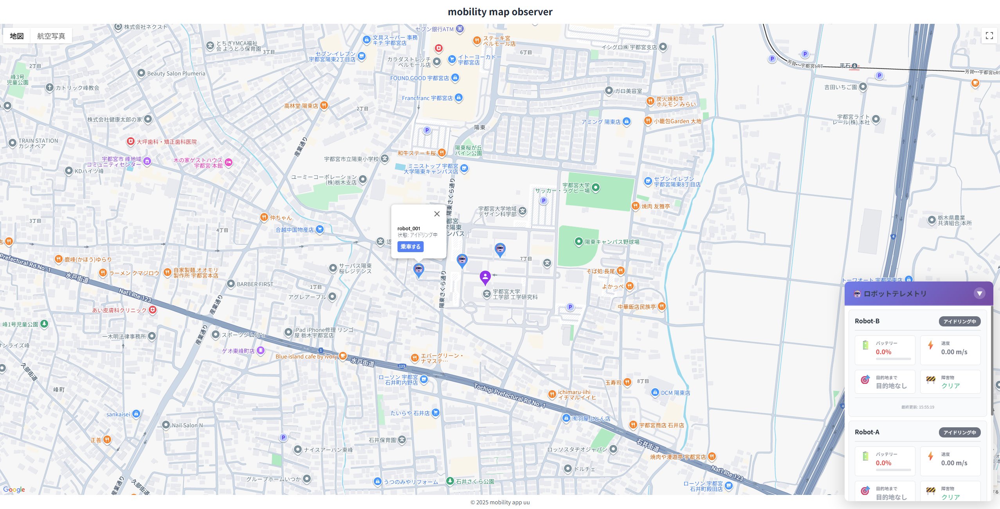
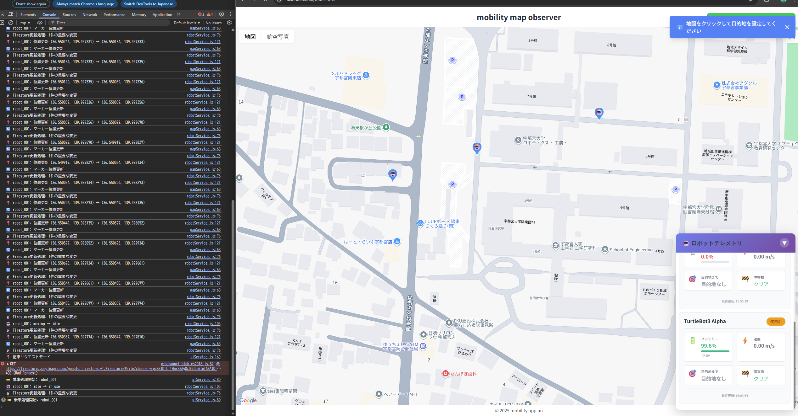
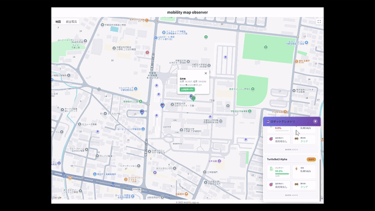

# 🗺️ Mobility Web App

Google MapsとFirebaseを使用した自律走行ロボットのリアルタイムWeb制御インターフェース

Real-time web interface for autonomous robot control using Google Maps and Firebase





---

## 🇯🇵 日本語

### 📋 概要

このWebアプリケーションは、以下の機能を提供します：

- 🤖 **ロボット配車**: 利用可能なロボットの選択・呼び出し
- 📍 **目的地設定**: 地図クリックによる直感的な操作
- 📊 **テレメトリ監視**: バッテリー、速度、センサーデータのリアルタイム表示
- 🗺️ **位置追跡**: マーカーの自動同期による移動状況の可視化

#### 主な特徴

- **サーバーレス構成**: Firebase直接統合（カスタムサーバー不要）
- **リアルタイム同期**: Firestoreリスナーによるサブ秒の位置更新
- **レスポンシブUI**: モバイル対応、折りたたみ可能なダッシュボード
- **スマート通知**: ロボット状態に応じた視覚的フィードバック

### 🏗️ アーキテクチャ

```
┌─────────────────────────────────────────────┐
│            Webアプリケーション              │
│  ┌─────────────────────────────────────┐   │
│  │      Google Maps API                │   │
│  │  - インタラクティブ地図レンダリング │   │
│  │  - マーカー管理                     │   │
│  │  - クリックイベント処理             │   │
│  └─────────────────────────────────────┘   │
│                                             │
│  ┌─────────────────────────────────────┐   │
│  │      サービス層                     │   │
│  │  - MapService: 地図操作             │   │
│  │  - RobotService: ロボット制御       │   │
│  │  - UIService: ユーザー操作          │   │
│  │  - SensorDashboard: テレメトリ表示  │   │
│  └─────────────────────────────────────┘   │
│                                             │
│  ┌─────────────────────────────────────┐   │
│  │      Firebase SDK                   │   │
│  │  - 匿名認証                         │   │
│  │  - Firestoreリアルタイムリスナー    │   │
│  │  - GeoPointクエリ                   │   │
│  └─────────────────────────────────────┘   │
└─────────────────────────────────────────────┘
                      ↕️
              ┌──────────────┐
              │   Firebase   │
              │  (Firestore) │
              └──────────────┘
```

### 🚀 クイックスタート

#### 前提条件

- モダンブラウザ（Chrome、Firefox、Safari）
- Firestoreが有効化されたFirebaseプロジェクト
- Google Maps APIキー

#### セットアップ手順

**1. リポジトリのクローン**

```bash
git clone https://github.com/Iruazu/mobility-web-app.git
cd mobility-web-app
```

**2. APIキーの設定**

プロジェクトルートに `apiKey.js` を作成：

```javascript
const GOOGLE_API_KEY = 'YOUR_GOOGLE_MAPS_API_KEY';
```

**3. Firebase設定の更新**

`js/config/firebase.js` を編集：

```javascript
const firebaseConfig = {
  apiKey: "YOUR_FIREBASE_API_KEY",
  authDomain: "your-project.firebaseapp.com",
  projectId: "your-project-id",
  storageBucket: "your-project.appspot.com",
  messagingSenderId: "123456789",
  appId: "1:123456789:web:abcdef123456",
  measurementId: "G-XXXXXXXXXX"
};
```

**4. アプリケーションの起動**

方法A: Python HTTPサーバー
```bash
python -m http.server 8000
# ブラウザで http://localhost:8000 を開く
```

方法B: VS Code Live Server
- 「Live Server」拡張機能をインストール
- `index.html` を右クリック → 「Open with Live Server」

方法C: Node.js http-server
```bash
npx http-server -p 8000
```

**5. Firestoreデータの初期化**

```javascript
// Firebase Console > Firestore
robots/robot_001: {
  id: "robot_001",
  name: "TurtleBot3 Alpha",
  status: "idle",
  position: new GeoPoint(36.55077, 139.92957),
  heading: 0.0,
  telemetry: {
    battery_percent: 100,
    speed: 0,
    obstacle_detected: false,
    distance_to_goal: null
  }
}
```

### 📁 プロジェクト構造

```
mobility-web-app/
├── index.html                      # メインHTMLエントリポイント
├── style.css                       # グローバルスタイル
├── dashboard-styles.css            # テレメトリダッシュボード専用CSS
├── apiKey.js                       # Google Maps APIキー（.gitignore対象）
│
├── js/
│   ├── main.js                     # アプリケーションエントリポイント
│   ├── config/
│   │   └── firebase.js             # Firebase設定
│   ├── services/
│   │   ├── mapService.js           # Google Maps統合
│   │   ├── robotService.js         # ロボット制御ロジック
│   │   ├── uiService.js            # UI操作
│   │   └── sensorDashboard.js      # リアルタイムテレメトリ表示
│   └── utils/
│       └── geoUtils.js             # 地理計算ユーティリティ
│
└── docs/
    ├── images/                     # スクリーンショット・デモGIF
    ├── SETUP.md                    # 詳細セットアップガイド
    └── API.md                      # Firebaseスキーマドキュメント
```

### 🎯 コアサービス

#### 1️⃣ MapService (`js/services/mapService.js`)

Google Maps操作を管理

**主要メソッド**:
```javascript
mapService.initializeMap(elementId, clickCallback)
mapService.createRobotMarker(docId, robotData)
mapService.placeDestinationMarker(location, robotDocId)
mapService.removeUserMarker()
```

#### 2️⃣ RobotService (`js/services/robotService.js`)

ロボット制御とFirebase通信を担当

**主要メソッド**:
```javascript
robotService.callRobot(lat, lng)
robotService.setDestination(robotId, lat, lng)
robotService.handleRideAction(docId, 'ride' | 'getoff')
robotService.getInUseRobot()
```

#### 3️⃣ UIService (`js/services/uiService.js`)

ユーザーインタラクションと通知を管理

**主要メソッド**:
```javascript
uiService.showNotification(message, type, duration)
uiService.handleMapClick(location)
uiService.clearAllNotifications()
```

#### 4️⃣ SensorDashboard (`js/services/sensorDashboard.js`)

リアルタイムテレメトリ可視化

**主要メソッド**:
```javascript
sensorDashboard.updateRobotSensors(robotId, robotData)
sensorDashboard.removeRobotPanel(robotId)
sensorDashboard.toggleDashboard()
```

### 🔄 データフロー

```
1. ユーザーが地図をクリック
   ↓
2. UIService.handleMapClick() がGPS座標を取得
   ↓
3. RobotService.callRobot(lat, lng) を呼び出し
   ↓
4. Firestore更新: robots/{robotId}/destination = GeoPoint(lat, lng)
   ↓
5. ROS2 Bridgeが変更を検知（リスナー経由）
   ↓
6. ロボットが目的地へ移動開始
   ↓
7. 位置更新 → Firestore
   ↓
8. Web UIマーカーがリアルタイムで移動
```

### 🎨 UIコンポーネント

**センサーダッシュボード**
- 配置: 画面右下に固定
- 機能: 折りたたみ可能パネル、リアルタイムテレメトリ、色分けステータス

**ロボットマーカー**
- アイドリング中: 🔵 青色ピン
- 使用中: 🟠 オレンジ色ピン
- 走行中: 🟢 緑色ピン
- 配車中: 🟣 紫色ピン

### 🛡️ 安全機能

**無限ループ防止**
```javascript
if (!this.hasMarkerMoved(docId, newPosition)) {
  return; // 冗長な更新を回避
}
```

**境界チェック**
```javascript
const isValid = this.mapService.isWithinBounds(lat, lng);
if (!isValid) {
  showNotification("目的地が範囲外です", "error");
}
```

### 🔧 設定

**Firestoreセキュリティルール**
```javascript
rules_version = '2';
service cloud.firestore {
  match /databases/{database}/documents {
    match /robots/{robotId} {
      allow read: if true;
      allow write: if request.auth != null;
    }
  }
}
```

**Google Maps API制限**
```
Google Cloud Console > 認証情報 でAPIキーをドメインに制限:
- http://localhost:*
- https://yourdomain.com/*
```

### 🐛 トラブルシューティング

**問題: マーカーが更新されない**
```javascript
console.log("アクティブリスナー:", Object.keys(robotService.activeSimulations));
```

**問題: 地図が読み込まれない**
1. `apiKey.js` のAPIキーを確認
2. ブラウザコンソールでエラー確認
3. Google Cloud Consoleで使用量をチェック

**問題: "Permission denied" エラー**
- 上記のセキュリティルールを適用

### 📊 パフォーマンス指標

| コンポーネント | 更新頻度 | レイテンシ |
|--------------|---------|-----------|
| Web UI       | 60 fps  | < 50ms    |
| Firebase     | リアルタイム | < 100ms |
| 位置同期     | 1 Hz    | < 200ms   |

### 📚 リソース

- [Google Maps JavaScript API](https://developers.google.com/maps/documentation/javascript)
- [Firebase Web SDK](https://firebase.google.com/docs/web/setup)
- [Firestoreリアルタイムリスナー](https://firebase.google.com/docs/firestore/query-data/listen)

---

## 🇬🇧 English

### 📋 Overview

Interactive web application for autonomous robot control:

- 🤖 **Robot Dispatching**: Select and call available robots
- 📍 **Destination Setting**: Intuitive map click-based navigation
- 📊 **Telemetry Monitoring**: Real-time battery, speed, and sensor data
- 🗺️ **Position Tracking**: Automated marker synchronization

#### Key Features

- **Serverless Architecture**: Direct Firebase integration
- **Real-time Synchronization**: Sub-second position updates
- **Responsive UI**: Mobile-ready collapsible dashboard
- **Smart Notifications**: Visual feedback for all states

### 🏗️ Architecture

```
┌─────────────────────────────────────────────┐
│            Web Application                  │
│  ┌─────────────────────────────────────┐   │
│  │      Google Maps API                │   │
│  │  - Interactive map rendering        │   │
│  │  - Marker management                │   │
│  │  - Click event handling             │   │
│  └─────────────────────────────────────┘   │
│                                             │
│  ┌─────────────────────────────────────┐   │
│  │      Service Layer                  │   │
│  │  - MapService: Map operations       │   │
│  │  - RobotService: Robot control      │   │
│  │  - UIService: User interactions     │   │
│  │  - SensorDashboard: Telemetry       │   │
│  └─────────────────────────────────────┘   │
│                                             │
│  ┌─────────────────────────────────────┐   │
│  │      Firebase SDK                   │   │
│  │  - Anonymous authentication         │   │
│  │  - Firestore real-time listeners    │   │
│  │  - GeoPoint queries                 │   │
│  └─────────────────────────────────────┘   │
└─────────────────────────────────────────────┘
                      ↕️
              ┌──────────────┐
              │   Firebase   │
              │  (Firestore) │
              └──────────────┘
```

### 🚀 Quick Start

#### Prerequisites

- Modern browser (Chrome, Firefox, Safari)
- Firebase project with Firestore enabled
- Google Maps API key

#### Setup Instructions

**1. Clone Repository**

```bash
git clone https://github.com/Iruazu/mobility-web-app.git
cd mobility-web-app
```

**2. Configure API Keys**

Create `apiKey.js` in project root:

```javascript
const GOOGLE_API_KEY = 'YOUR_GOOGLE_MAPS_API_KEY';
```

**3. Update Firebase Config**

Edit `js/config/firebase.js`:

```javascript
const firebaseConfig = {
  apiKey: "YOUR_FIREBASE_API_KEY",
  authDomain: "your-project.firebaseapp.com",
  projectId: "your-project-id",
  storageBucket: "your-project.appspot.com",
  messagingSenderId: "123456789",
  appId: "1:123456789:web:abcdef123456",
  measurementId: "G-XXXXXXXXXX"
};
```

**4. Launch Application**

Option A: Python HTTP Server
```bash
python -m http.server 8000
# Open http://localhost:8000
```

Option B: VS Code Live Server
- Install "Live Server" extension
- Right-click `index.html` → "Open with Live Server"

Option C: Node.js http-server
```bash
npx http-server -p 8000
```

**5. Initialize Firestore**

```javascript
// Firebase Console > Firestore
robots/robot_001: {
  id: "robot_001",
  name: "TurtleBot3 Alpha",
  status: "idle",
  position: new GeoPoint(36.55077, 139.92957),
  heading: 0.0,
  telemetry: {
    battery_percent: 100,
    speed: 0,
    obstacle_detected: false,
    distance_to_goal: null
  }
}
```

### 📁 Project Structure

```
mobility-web-app/
├── index.html                      # Main HTML entry
├── style.css                       # Global styles
├── dashboard-styles.css            # Dashboard CSS
├── apiKey.js                       # Maps API key (gitignored)
│
├── js/
│   ├── main.js                     # App entry point
│   ├── config/firebase.js          # Firebase config
│   ├── services/
│   │   ├── mapService.js           # Maps integration
│   │   ├── robotService.js         # Robot control
│   │   ├── uiService.js            # UI interactions
│   │   └── sensorDashboard.js      # Telemetry display
│   └── utils/geoUtils.js           # Geographic utilities
│
└── docs/
    ├── images/                     # Screenshots & GIFs
    ├── SETUP.md                    # Setup guide
    └── API.md                      # Firebase schema
```

### 🎯 Core Services

#### 1️⃣ MapService (`js/services/mapService.js`)

**Key Methods**:
```javascript
mapService.initializeMap(elementId, clickCallback)
mapService.createRobotMarker(docId, robotData)
mapService.placeDestinationMarker(location, robotDocId)
```

#### 2️⃣ RobotService (`js/services/robotService.js`)

**Key Methods**:
```javascript
robotService.callRobot(lat, lng)
robotService.setDestination(robotId, lat, lng)
robotService.handleRideAction(docId, 'ride' | 'getoff')
```

#### 3️⃣ UIService (`js/services/uiService.js`)

**Key Methods**:
```javascript
uiService.showNotification(message, type, duration)
uiService.handleMapClick(location)
```

#### 4️⃣ SensorDashboard (`js/services/sensorDashboard.js`)

**Key Methods**:
```javascript
sensorDashboard.updateRobotSensors(robotId, robotData)
sensorDashboard.toggleDashboard()
```

### 🔄 Data Flow

```
1. User clicks map
   ↓
2. UIService captures GPS coordinates
   ↓
3. RobotService.callRobot(lat, lng)
   ↓
4. Firestore: robots/{id}/destination = GeoPoint
   ↓
5. ROS2 Bridge detects change
   ↓
6. Robot navigates
   ↓
7. Position updates → Firestore → Web UI
```

### 🎨 UI Components

**Sensor Dashboard**
- Location: Fixed bottom-right
- Features: Collapsible, real-time telemetry, color-coded status

**Robot Markers**
- Idle: 🔵 Blue
- In Use: 🟠 Orange
- Moving: 🟢 Green
- Dispatching: 🟣 Purple

### 🛡️ Safety Features

**Infinite Loop Prevention**
```javascript
if (!this.hasMarkerMoved(docId, newPosition)) {
  return; // Skip redundant updates
}
```

**Boundary Checking**
```javascript
if (!this.isWithinBounds(lat, lng)) {
  showNotification("Out of range", "error");
}
```

### 🔧 Configuration

**Firestore Security Rules**
```javascript
rules_version = '2';
service cloud.firestore {
  match /databases/{database}/documents {
    match /robots/{robotId} {
      allow read: if true;
      allow write: if request.auth != null;
    }
  }
}
```

**Maps API Restrictions**
```
Google Cloud Console > Credentials
- http://localhost:*
- https://yourdomain.com/*
```

### 🐛 Troubleshooting

**Markers not updating**
```javascript
console.log("Active listeners:", Object.keys(robotService.activeSimulations));
```

**Map not loading**
1. Check `apiKey.js`
2. Verify browser console
3. Check Cloud Console quotas

**Permission denied**
- Apply security rules from Configuration section

### 📊 Performance

| Component | Rate | Latency |
|-----------|------|---------|
| Web UI    | 60fps| <50ms   |
| Firebase  | Real-time | <100ms |
| Position  | 1Hz  | <200ms  |

### 📚 Resources

- [Google Maps JavaScript API](https://developers.google.com/maps/documentation/javascript)
- [Firebase Web SDK](https://firebase.google.com/docs/web/setup)
- [Firestore Listeners](https://firebase.google.com/docs/firestore/query-data/listen)

---

## 🤝 コントリビューション / Contributing

1. リポジトリをフォーク / Fork repository
2. フィーチャーブランチを作成 / Create branch (`git checkout -b feature/amazing-feature`)
3. 変更をコミット / Commit (`git commit -m 'feat: add feature'`)
4. ブランチにプッシュ / Push (`git push origin feature/amazing-feature`)
5. プルリクエストを作成 / Open Pull Request

---

## 📝 ライセンス / License

MIT License - 詳細は [LICENSE](LICENSE) を参照 / See [LICENSE](LICENSE)

---

## 👨‍💻 開発体制 / Development Team

- **委託元 / Client**: 宇都宮大学 星野研究室 / Utsunomiya University, Hoshino Lab
- **Project Leader**: Yugo Obana
- **Contributors**: （新メンバー追加予定 / New members coming soon）

---

## 👤 作成者 / Author

**Yugo Obana**
- GitHub: [@Iruazu](https://github.com/Iruazu)
- LinkedIn: [yugo-dev](https://www.linkedin.com/in/yugo-dev)

---

## 🙏 謝辞 / Acknowledgments

- 宇都宮大学 星野研究室 / Utsunomiya University, Hoshino Lab
- Google Maps Platform
- Firebase Team
- オープンソースコミュニティ / Open-source community